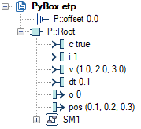

# Basic integration test for the Python wrapper
## Overview
The project `Sandbox` allows testing manually the Python wrapper.

## Setup
* Register the package to SCADE as detailed in
  [Install in user mode](<https://python-wrapper.scade.docs.pyansys.com/version/dev/contributing.html#install-in-user-mode>).

## Test
### Command line
* Open `Model/Model.etp` with SCADE Suite.
* Select the configuration `Python`.
* Launch the command `Project/Code Generator/Build Node Root` and verify the build is successful.
* Open a command line window and execute ``Client\client.py``:

  ```cmd
  python Client\client.py
  ```

  Verify it displays the following traces:

  ```
  0 0.6 0.7 0.8
  0 1.2 1.4 1.6
  1 1.7999999999999998 2.0999999999999996 2.4000000000000004
  2 2.4 2.8 3.2
  ```

### Simulation
* Open `Model/Model.etp` with SCADE Suite.
* Select the configuration `Python`.
* Launch the command `Project/Code Generator/Build Node Root` and verify the build is successful.
* Select the configuration `Simulation`.
* Launch the command `Project/Code Generator/Build Node Root` and verify the build is successful.
* Open a command line window and execute ``Client\client.py``:

  ```cmd
  python Client\client.py
  ```

  Verify the SCADE Simulator starts and pauses at the first cycle:
  The Instances views shall be as follows:

  

  Execute the remaining steps with the command `Simulation/Go`, observe the
  updates in the SCADE Simulator's views, and verify the traces in the command
  line window:

  ```
  0 0.6 0.7 0.8
  0 1.2 1.4 1.6
  1 1.7999999999999998 2.0999999999999996 2.4000000000000004
  2 2.4 2.8 3.2
  ```

## Clean
You may uninstall the package once the manual tests are completed:

* Unregister the package from SCADE as detailed in
  [Uninstall](<https://python-wrapper.scade.docs.pyansys.com/version/dev/contributing.html#uninstall>).
